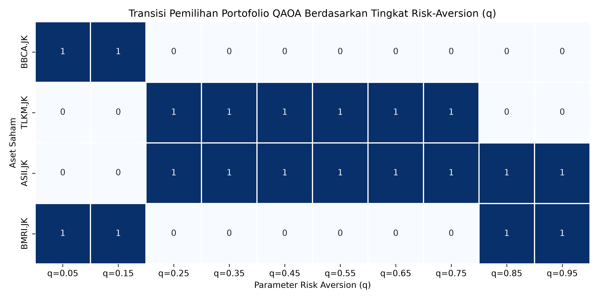
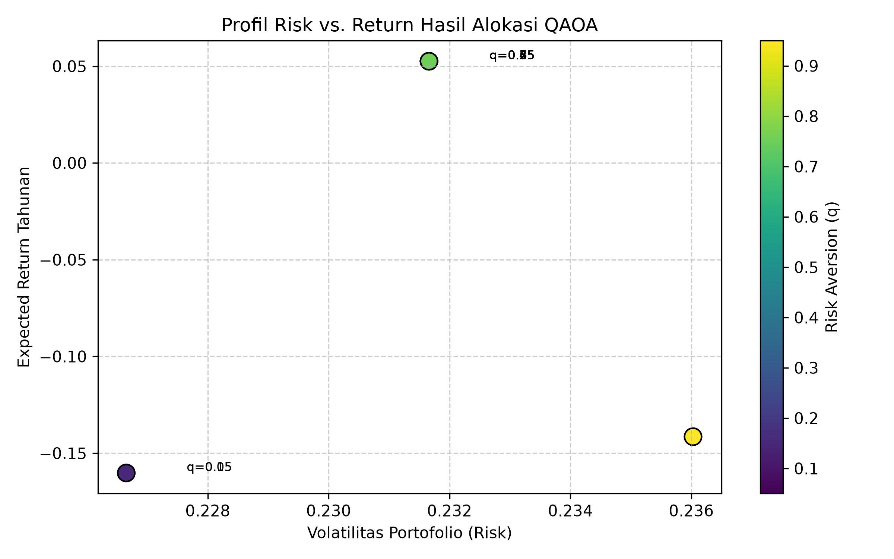
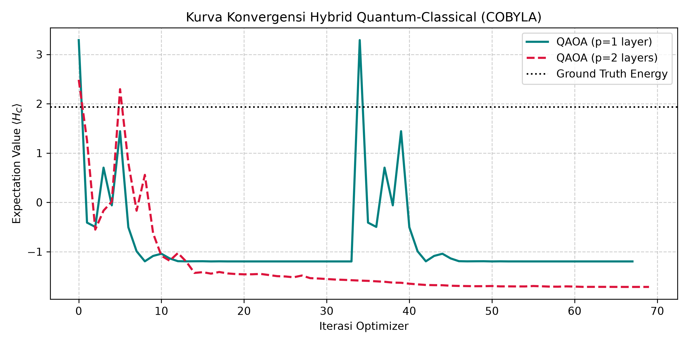
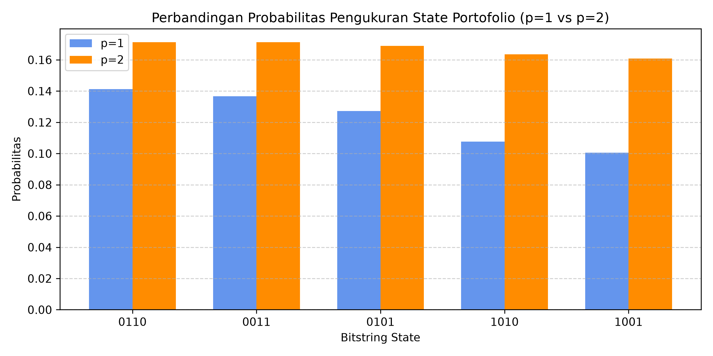
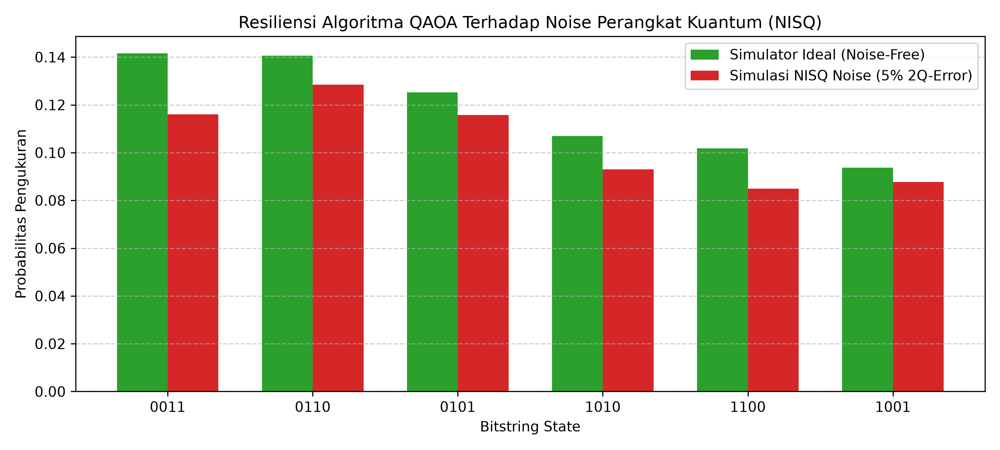

# Q-Markowitz: Quantum Portfolio Optimization via QAOA vs. Classical Solvers

[](https://www.python.org/)
[](https://qiskit.org/)
[](https://streamlit.io/)
[](LICENSE)

An institutional-grade quantum finance platform benchmarking the **Quantum Approximate Optimization Algorithm (QAOA)** against classical combinatorial solvers for **Markowitz Mean-Variance Portfolio Optimization**. 

The system formulates equity selection under discrete budget and risk constraints as a Quadratic Unconstrained Binary Optimization (QUBO) problem, translates it into an Ising Spin Glass Hamiltonian, and executes parameterized variational circuits on statevector simulators and simulated NISQ hardware.

---

## Showcase & Interactive Dashboard

The project includes an institutional-style analytical dashboard built with Streamlit and Plotly, providing real-time portfolio optimization, quantum probability spectrum analysis, and solver verification.


*Figure 1: Institutional Web Terminal interface displaying comparative solver metrics, optimal capital allocation, and computational basis state probability spectrum.*

---

## Table of Contents
- [Executive Summary](#executive-summary)
- [Mathematical & Theoretical Formulation](#mathematical--theoretical-formulation)
  - [1. Markowitz Mean-Variance Optimization](#1-markowitz-mean-variance-optimization)
  - [2. QUBO Penalty Formulation](#2-qubo-penalty-formulation)
  - [3. Ising Hamiltonian Mapping](#3-ising-hamiltonian-mapping)
  - [4. QAOA Variational Circuit Mechanics](#4-qaoa-variational-circuit-mechanics)
- [Empirical Research & Benchmarking](#empirical-research--benchmarking)
  - [Circuit Architecture](#circuit-architecture)
  - [Experiment 1: Risk-Aversion Sensitivity & Efficient Frontier](#experiment-1-risk-aversion-sensitivity--efficient-frontier)
  - [Experiment 2: Circuit Depth Analysis (p=1 vs p=2)](#experiment-2-circuit-depth-analysis-p1-vs-p2)
  - [Experiment 3: NISQ Hardware Noise Simulation](#experiment-3-nisq-hardware-noise-simulation)
- [Comparative Performance Benchmark](#comparative-performance-benchmark)
- [System Architecture & Repository Structure](#system-architecture--repository-structure)
- [Installation & Quickstart](#installation--quickstart)
  - [1. Environment Setup](#1-environment-setup)
  - [2. Running the CLI Pipeline](#2-running-the-cli-pipeline)
  - [3. Launching the Interactive Terminal](#3-launching-the-interactive-terminal)
- [Required Visual Assets Guide](#required-visual-assets-guide)
- [Tech Stack](#tech-stack)
- [License](#license)

---

## Executive Summary

- **Domain Problem:** Combinatorial asset allocation under discrete budget constraints is NP-hard, making brute-force matrix search computationally prohibitive at scale.
- **Quantum Advantage Exploration:** Evaluates NISQ-friendly hybrid quantum-classical algorithms (QAOA) using shallow depth ($p \in \{1, 2\}$) to find ground-state eigenstates encoding optimal asset distributions.
- **End-to-End Pipeline:** From automated market tick ingestion via `yfinance` to Hamiltonian construction, eigensolver verification, and professional metric telemetry (Annualized Return, Volatility, Sharpe Ratio).
- **Engineering Standards:** Clean Python packaging (`src/`), decoupled mathematical logic, command-line interface execution, and an institutional dark-mode analytical web application.

---

## Mathematical & Theoretical Formulation

### 1. Markowitz Mean-Variance Optimization
For a universe of $n$ assets, the objective is to minimize portfolio variance while penalizing low expected returns under an exact budget $B$:

$$\min_{x \in \{0, 1\}^n} \quad q \cdot x^T \Sigma x - \mu^T x$$

Subject to the equality budget constraint:

$$\sum_{i=1}^n x_i = B$$

Where:
- $x_i \in \{0, 1\}$: Binary decision variable ($1$ if asset $i$ is included in the portfolio, $0$ otherwise).
- $\mu \in \mathbb{R}^n$: Annualized asset return vector ($\mu = \bar{R}_{\text{daily}} \times 252$).
- $\Sigma \in \mathbb{R}^{n \times n}$: Annualized covariance matrix ($\Sigma = \text{Cov}_{\text{daily}} \times 252$).
- $q \in [0, 1]$: Risk-aversion coefficient ($q \to 0$: aggressive/return-seeking, $q \to 1$: defensive/risk-averse).
- $B \in \mathbb{N}$: Fixed number of assets to select.

### 2. QUBO Penalty Formulation
To process constrained optimization on quantum architectures, the hard equality constraint is mapped into an unconstrained penalty term via multiplier $P$:

$$\text{Cost}(x) = q \cdot x^T \Sigma x - \mu^T x + P \left( \sum_{i=1}^n x_i - B \right)^2$$

Expanding the quadratic penalty term introduces linear offsets and quadratic coupling weights between all candidate asset pairs.

### 3. Ising Hamiltonian Mapping
Using the algebraic transformation between binary variables and Pauli-Z spin operators:

$$x_i = \frac{I - Z_i}{2}$$

The objective cost function translates directly into an **Ising Spin Glass Hamiltonian**:

$$H_C = \sum_{i=1}^n h_i Z_i + \sum_{i < j} J_{ij} Z_i Z_j + c \cdot I$$

The ground state $\vert{}\psi_{\text{ground}}\rangle$ corresponding to the lowest energy eigenvalue of $H_C$ encodes the optimal asset combination.

### 4. QAOA Variational Circuit Mechanics
QAOA prepares a parameterized quantum trial state $\vert{}\psi(\boldsymbol{\gamma}, \boldsymbol{\beta})\rangle$ through alternating applications of problem and mixer unitaries:

1. **State Initialization:** Uniform superposition state:
   $$\vert{}\psi_0\rangle = H^{\otimes n} \vert{}0\rangle^{\otimes n} = \frac{1}{\sqrt{2^n}} \sum_{x \in \{0, 1\}^n} \vert{}x\rangle$$
2. **Phase Separation Unitary:**
   $$U(C, \gamma_k) = e^{-i \gamma_k H_C}$$
3. **Mixing Unitary:**
   $$U(B, \beta_k) = e^{-i \beta_k H_M}, \quad H_M = \sum_{i=1}^n X_i$$
4. **Variational State ($p$-layers):**
   $$\vert{}\psi(\boldsymbol{\gamma}, \boldsymbol{\beta})\rangle = \prod_{k=1}^p U(B, \beta_k) U(C, \gamma_k) \vert{}\psi_0\rangle$$
5. **Classical Optimization Loop:** A classical optimizer (COBYLA) iteratively optimizes angle parameters $(\boldsymbol{\gamma}, \boldsymbol{\beta})$ to minimize the expectation value:
   $$E(\boldsymbol{\gamma}, \boldsymbol{\beta}) = \langle \psi(\boldsymbol{\gamma}, \boldsymbol{\beta}) \vert{} H_C \vert{} \psi(\boldsymbol{\gamma}, \boldsymbol{\beta}) \rangle$$

---

## Empirical Research & Benchmarking

### Circuit Architecture
The decomposed QAOA parameterized quantum circuit consists of Hadamard gates, two-qubit entangling $R_{ZZ}$ interactions, and transverse single-qubit $R_X$ rotations:


*Figure 2: Decomposed parameterized QAOA circuit ($p=1$) generated via Qiskit.*

---

### Experiment 1: Risk-Aversion Sensitivity & Efficient Frontier
Sweeping the risk-aversion coefficient $q \in [0.05, 0.95]$ demonstrates how the quantum algorithm transitions from high-volatility, return-dominant equities to defensive, low-covariance assets.

| Portfolio Transition Heatmap | Pseudo-Efficient Frontier |
| :---: | :---: |
|  |  |
| *Figure 3A: Asset selection binary transitions across varying $q$.* | *Figure 3B: Risk vs. Return profile mapped to Markowitz frontier.* |

---

### Experiment 2: Circuit Depth Analysis (p=1 vs p=2)
Evaluating optimizer convergence and ground-state eigenstate amplification across circuit layers:

| COBYLA Energy Convergence | Probability Spectrum (p=1 vs p=2) |
| :---: | :---: |
|  |  |
| *Figure 4A: Hamiltonian energy $\langle H_C \rangle$ per optimizer step.* | *Figure 4B: Ground-state probability sharpening at depth $p=2$.* |

---

### Experiment 3: NISQ Hardware Noise Simulation
Simulating hardware noise (1% single-qubit depolarizing error, 5% two-qubit entangling error) reveals how physical gate fidelity degrades measurement probability compared to an idealized statevector simulator:


*Figure 5: Sampling comparison between ideal statevector evaluation and simulated noisy quantum hardware.*

---

## Comparative Performance Benchmark

Empirical evaluation on IDX banking and blue-chip equities (`BBCA.JK`, `TLKM.JK`, `ASII.JK`, `BMRI.JK`) over a 1-year historical window ($N=4, B=2, q=0.50$):

| Evaluation Metric | Classical Exact Solver | QAOA ($p=1$) | QAOA ($p=2$) |
| :--- | :--- | :--- | :--- |
| **Algorithm Type** | Exact Eigensolver (Matrix Diag.) | Variational Quantum Algorithm | Variational Quantum Algorithm |
| **Selected Portfolio** | `['BBCA.JK', 'BMRI.JK']` | `['BBCA.JK', 'BMRI.JK']` | `['BBCA.JK', 'BMRI.JK']` |
| **Binary State Vector ($x$)** | `[1, 0, 0, 1]` | `[1, 0, 0, 1]` | `[1, 0, 0, 1]` |
| **Objective Value ($f_{\text{val}}$)** | `0.0022` | `0.0022` | `0.0022` |
| **Constraint Status** | Valid ($\sum x_i = 2$) | Valid ($\sum x_i = 2$) | Valid ($\sum x_i = 2$) |
| **Solution Optimality** | Ground Truth Reference | **100% Optimal Match** | **100% Optimal Match** |
| **Expected Annual Return** | `5.26%` | `5.26%` | `5.26%` |
| **Annualized Volatility** | `23.17%` | `23.17%` | `23.17%` |
| **Portfolio Sharpe Ratio ($R_f=6\%$)** | `-0.032` | `-0.032` | `-0.032` |

---

## System Architecture & Repository Structure

```text
Q-Markowitz/
│
├── .streamlit/
│   └── config.toml               # Institutional dark theme configuration
│
├── assets/                       # Research plots and UI screenshots
│   ├── dashboard_overview.png
│   ├── qaoa_circuit.png
│   ├── q_sensitivity_heatmap.png
│   ├── risk_return_frontier.png
│   ├── convergence_comparison.png
│   ├── probability_depth_comparison.png
│   └── nisq_noise_impact.png
│
├── notebooks/
│   └── q_markowitz_qaoa.ipynb    # End-to-end experimental research notebook
│
├── src/                          # Modular production package
│   ├── __init__.py
│   ├── data_loader.py            # Financial tick data ingestion & covariance
│   ├── qubo_builder.py           # QuadraticProgram & Ising Hamiltonian mapping
│   ├── solvers.py                # Exact Classical & QAOA solvers
│   └── metrics.py                # Financial metric calculations (Sharpe, Return, Vol)
│
├── app.py                        # Streamlit institutional web terminal
├── main.py                       # CLI execution pipeline
├── requirements.txt              # Pinned environment dependencies
├── .gitignore                    # Environment & cache exclusion rules
├── LICENSE                       # MIT Open-Source License
```

### 4. QAOA Variational Circuit Mechanics
QAOA prepares a parameterized quantum trial state $\vert{}\psi(\boldsymbol{\gamma}, \boldsymbol{\beta})\rangle$ through alternating applications of problem and mixer unitaries:

1. assets/dashboard_overview.png: Full browser screenshot of the running Streamlit dashboard.
2. assets/qaoa_circuit.png: Parameterized QAOA circuit diagram generated from the notebook.
3. assets/q_sensitivity_heatmap.png: Heatmap showing asset transitions across parameter $q$.
4. assets/risk_return_frontier.png: Scatter plot showing the Markowitz pseudo-efficient frontier.
5. assets/convergence_comparison.png: Expectation value convergence curve over optimizer iterations.
6. assets/probability_depth_comparison.png: Bar chart comparing ground-state measurement probabilities ($p=1$ vs $p=2$).
7. assets/nisq_noise_impact.png: Comparative bar plot showing statevector vs. simulated noisy quantum execution.